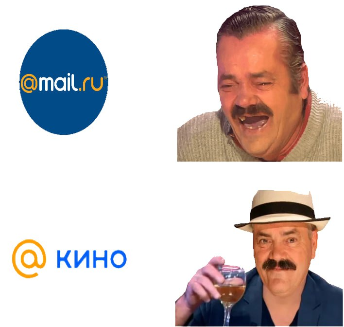

# RecSystems_Project_Faiss

## Наше приложение разработано в двух вариантах и развернуто на двух платформах.
### Вариант, развернутый на [Huggingface](https://huggingface.co/spaces/AnastasiaMozhayskaya/RecSystems_Project1) без Fiass, работает чуть медленно, но выдает более релевантные результаты в некоторых случаях, сходимость по косинусному сходству. Вариант, развернутый непосредственно на [Streamlit](https://recsystemsprojectfaiss-tdtszhhdqfp5s8jymc5foe.streamlit.app/) работает с Fiass, работает быстро, сходимость по Евклидовому расстоянию.

### Команда: [Роман](https://github.com/r-makushkin), [Алексей](https://github.com/WeinsGH), Анастасия

# **Проект:** Рекомендательные системы. Сервис умного поиска сериалов 📽️

### Задачи:
* Собрать выборку из не менее, чем 5000 сериалов
* Разработать систему поиска сериала по пользовательскому запросу. 
* Описания сериалов на русском языке
* Сервис должен принимать на вход описание сериала от пользователя и возвращать заданное количество подходящих вариантов

### Итоги:
* Парсинг с kino.mail.ru
* Сбор и анализ информации с киносервиса. Формирование датасета. Итоговый размер - 14939 объектов. 
* Предобработка данных
* Векторизация с использованием модели RuBERT + Faiss(для ускорения выдачи)
* Степень соответствия вычисляется по Евклидовому расстоянию, библиотека Faiss
